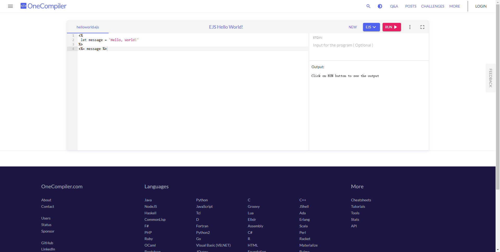

# 日常开发中如何利用 EJS 模板引擎辅助生成代码?

在如今的前端开发中，[EJS](https://ejs.bootcss.com/) 已经是一个过时的开发方案，但其实在辅助开发方面还是用处的。话不多说，接下来以一个例子来感受下。

## 例子

在日常开发中，有时候会遇到后端有一些枚举字典的定义，前端也要进行相应的配置。例如在做权限功能时，后端给了我们下面的权限码数据:

```json
[
  {
    "id": 1,
    "code": "access:readAbc",
    "authName": "读取权限",
    "level": 1
  },
  {
    "id": 2,
    "code": "access:writeAbc",
    "authName": "写入权限"
  }
]
```

我们需要把他做成枚举的形式, 也就是下面的形式：

```typescript
/**
 * 权限码
 */
export const enum AuthEnum {
  /**
   * 读取权限
   */
  ReadAbc = "access:readAbc",
  /**
   * 写入权限
   */
  WriteAbc = "access:writeAbc",
}
```

那么如何从这项无聊的工作中解放出来呢，操作也比较简单。

1\. 首先打开一个能编译 EJS 的在线网站， 例如 [One Compiler](https://onecompiler.com/ejs)。


2\. 根据目标数据结构整理下代码，点击`RUN`按钮即可。

```typescript
<%
 let items = [
  {
    "id": 1,
    "code": "access:readAbc",
    "authName": "读取权限",
  },
  {
    "id": 2,
    "code": "access:writeAbc",
    "authName": "写入权限",
  },
 ]
 items = items.map(item => {
   let key = item.code.substring(7);
   key = key.charAt(0).toUpperCase() + key.slice(1)
   return { ...item, key }
 })
-%>
/**
 * 权限码
 */
export const enum DaEnum {
  <% items.forEach((i, index) => { -%>
  /**
   * <%= i.authName %>
   */
  <%= i.key %> = '<%= i.code %>',
  <% }) -%>
}
```

## 结语

以上这是一个简单的例子，但在命令行工具进行页面模板的生成方面可能用得比较多。另外，EJS 的语法也不难，在一些重复性的代码生成方面还是不错的。
